# 🎬 Creative Agent - AI-Powered Marketing Campaign Generator

> **Built for Cycls' AI Challenge** - A sophisticated multi-step AI chain that generates culturally-aware marketing campaigns for the Riyadh/KSA market.

## 🏗️ System Architecture

The Creative Market Agent is built on a sophisticated **8-Phase AI Intelligence Processing Chain** that transforms basic product information into culturally-aware, compliance-ready marketing campaigns for the Riyadh/KSA market.



*[View full-size diagram](architecture_clean_no_emoji.svg) | [PNG version](architecture_clean_no_emoji.png)*

### **Core Components**

- **🎨 User Experience Layer**: Streamlit Web Application with modern React-like components
- **🧠 AI Intelligence Processing Chain**: 8 sequential phases from input to output
- **⚙️ Enterprise Backend Infrastructure**: Google Gemini API integration with modular services
- **📊 Data Architecture**: Structured JSON flow with validation and quality assurance
- **🛠️ Technology Stack**: Python 3.8+, Streamlit, Gemini API, and clean architecture principles

## 🚀 What This App Does

The Creative Agent is an intelligent web application that transforms basic product information into complete, culturally-relevant marketing campaigns. It uses an 8-step AI chain to generate:

- **Creative Angles** (5 distinct approaches)
- **Campaign Ideas** (3 detailed concepts: A, B, C)
- **30-40 Second Scripts** (narrative ad copy)
- **Social Media Captions** (Instagram & X/Twitter)
- **Call-to-Actions** (compelling CTAs)
- **Compliance Notes** (KSA advertising guidelines)

## 🧠 How the Chain of Thoughts Works

### **The Magic: 8-Step AI Intelligence Chain**

```
User Input → [AI Chain] → Polished Campaign Output
```

Each step processes JSON data from the previous step, building intelligence and cultural awareness:

#### **Step 1: Brief Normalizer** 🔍
- **Input**: Raw user inputs (product, description, audience, tone, language)
- **Process**: Cleans, standardizes, and enriches with KSA context
- **Output**: Structured JSON with objectives and constraints
- **Smart Defaults**: If audience is empty → defaults to "People in Riyadh, Saudi Arabia"

#### **Step 2: Market Intelligence** 📊
- **Input**: Cleaned brief + current context
- **Process**: Analyzes current KSA market conditions
- **Output**: Cultural moments, local trends, seasonal relevance
- **Real-time Awareness**: Knows current date, season, cultural events

#### **Step 3: Angle Generator** 💡
- **Input**: Brief + market insights + current context
- **Process**: Creates 5 distinct creative angles
- **Output**: Strategic approaches with cultural hooks
- **Timing Intelligence**: Leverages current events and seasonal opportunities

#### **Step 4: Idea Writer** ✍️
- **Input**: Brief + angles
- **Process**: Writes 3 detailed campaign ideas (A, B, C)
- **Output**: Complete campaigns with scripts, captions, CTAs
- **Cultural Relevance**: Ensures KSA market appropriateness

#### **Step 5: Critic & Improve** 🔧
- **Input**: Brief + ideas
- **Process**: Identifies weaknesses and revises
- **Output**: Improved versions only
- **Quality Control**: Fixes clarity, hooks, and cultural sensitivity

#### **Step 6: Compliance Check** ✅
- **Input**: Brief + improved ideas
- **Process**: Verifies KSA advertising guidelines
- **Output**: Compliant content with notes
- **Cultural Safety**: Ensures modesty, respect, and appropriateness

#### **Step 7: Localize/Polish** 🌍
- **Input**: Brief + compliant ideas
- **Process**: Refines language and tone
- **Output**: Final polished content
- **Style Guide**: Applies friendly, conversational voice

#### **Step 8: Final Presenter** 🎯
- **Input**: Polished ideas
- **Process**: Formats for user consumption
- **Output**: Beautiful Markdown presentation
- **User Experience**: No JSON shown, only polished results

## 🔄 What Happens When You Leave Fields Empty vs. Fill Them

### **Scenario 1: Minimal Input (Empty Fields)**
```
Product: "Lemon and Mint"
Description: [empty]
Audience: [empty]
Tone: [empty]
Language: English
```

**AI Chain Response:**
- **Step 1**: Assumes generic soft drink, defaults audience to Riyadh/KSA
- **Step 2**: Uses current season/events for generic insights
- **Step 3**: Creates broad angles like "refreshing drink" and "summer beverage"
- **Step 4**: Writes generic scripts with basic scenarios
- **Result**: Functional but generic campaigns

### **Scenario 2: Detailed Input (Filled Fields)**
```
Product: "Lemon and Mint"
Description: "A new and refreshing soft drink made from natural ingredients, perfect for hot summer days in Riyadh. Features real lemon zest and mint leaves, no artificial flavors, and comes in eco-friendly packaging."
Audience: [empty] → defaults to Riyadh/KSA
Tone: [empty] → AI infers from description
Language: English
```

**AI Chain Response:**
- **Step 1**: Enriches with specific details (natural ingredients, eco-packaging, summer relevance)
- **Step 2**: Analyzes eco-conscious market, natural food trends, summer refreshment
- **Step 3**: Creates targeted angles:
  - "Eco-warrior refreshment" (packaging angle)
  - "Natural vs. artificial" (ingredient quality)
  - "Summer survival essential" (weather relevance)
- **Step 4**: Writes specific scenarios:
  - "It's 3 PM in Riyadh, 45°C outside..."
  - "Your eco-conscious friend notices the packaging..."
- **Result**: Compelling, targeted, culturally-aware campaigns

## 🌟 Key Features That Make This Special

### **1. Real-Time Cultural Awareness**
- **Automatic Date Detection**: Knows current month, season, cultural events
- **KSA Cultural Calendar**: Ramadan, Eid, National Day, seasonal festivals
- **Weekend Context**: Friday-Saturday awareness for timing

### **2. Smart Defaults & Intelligence**
- **Market Default**: Always assumes Riyadh/KSA unless specified
- **Language Auto-Detection**: Can infer language from input content
- **Cultural Sensitivity**: Built-in compliance checking

### **3. Modular Architecture**
- **`app.py`**: Clean Streamlit UI only
- **`chain.py`**: All AI processing steps
- **`utils.py`**: Configuration, API handling, context utilities

### **4. JSON-Only Communication**
- **Strict Data Flow**: Each step passes structured JSON
- **No Information Loss**: Data integrity throughout the chain
- **Easy Debugging**: Clear data structure at each step

## 🛠️ Technical Stack

- **Frontend**: Streamlit (Python web framework)
- **AI Engine**: Google Gemini API (gemini-1.5-flash)
- **Architecture**: Modular Python with type hints
- **Deployment**: Streamlit Cloud ready
- **Security**: Environment variables for API keys

## 🚀 Getting Started

### **Local Development**
```bash
# Clone and setup
git clone https://github.com/mrumer-yk/creative_market_agent.git
cd creative_market_agent

# Create virtual environment
python -m venv .venv
.\.venv\Scripts\Activate.ps1  # Windows
source .venv/bin/activate     # Mac/Linux

# Install dependencies
pip install -r requirements.txt

# Set API key
$env:GEMINI_API_KEY="your_api_key_here"

# Run the app
python -m streamlit run assignment/app.py
```

### **Streamlit Cloud Deployment**
1. Push code to GitHub
2. Connect repository to Streamlit Cloud
3. Add `GEMINI_API_KEY` to Streamlit Secrets
4. Deploy automatically

## 📁 Project Structure

```
creative_market_agent/
├── assignment/
│   ├── app.py          # Streamlit UI (clean, focused)
│   ├── chain.py        # All AI chain step functions
│   ├── utils.py        # Configuration, API, context utilities
│   ├── requirements.txt # Python dependencies
│   └── README.md       # This comprehensive guide
├── .gitignore          # Git ignore patterns
└── README.md           # Project overview
```

## 🎯 Use Cases

### **Marketing Agencies**
- Generate campaign ideas for multiple clients
- Ensure cultural compliance for KSA market
- Create consistent brand voice across campaigns

### **Small Businesses**
- Professional marketing without agency costs
- Culturally-appropriate content for Saudi market
- Quick campaign generation for seasonal promotions

### **Content Creators**
- Social media content ideas
- Caption generation for Instagram/X
- Brand storytelling frameworks

## 🔍 How to Test the Chain Intelligence

### **Test 1: Minimal Input**
1. Enter only product name
2. Click Generate
3. Observe how AI fills gaps with cultural context

### **Test 2: Detailed Input**
1. Fill all fields with specific details
2. Click Generate
3. Compare output quality and specificity

### **Test 3: Language Switching**
1. Test with English input
2. Test with Arabic input
3. Observe cultural adaptation

## 🚨 Important Notes

- **API Key Required**: You need a valid Gemini API key
- **Internet Connection**: Required for AI model calls
- **Cultural Sensitivity**: Content is automatically checked for KSA compliance
- **Rate Limits**: Respect Gemini API usage limits

## 🤝 Contributing

This project is built for Cycls' AI Challenge. Feel free to:
- Report bugs
- Suggest improvements
- Add new cultural contexts
- Enhance the AI chain

## 📞 Support

For issues or questions:
- Check the [GitHub repository](https://github.com/mrumer-yk/creative_market_agent)
- Review the code structure in `chain.py` and `utils.py`
- Test with different input combinations

---

**Built with ❤️ for the Riyadh creative community**
